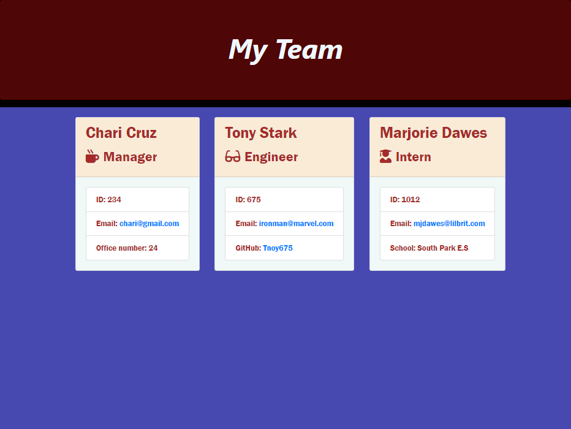

# Team Profile Generator

## Table of Content

- [Description](#Description)
- [Installation](#Installation)
- [Visual](#Visual)
- [Usage](#Usage)
- [Resource](#Resource)
- [License](#License)
- [Test](#Test)
- [Questions](#Questions)

## Description

This is an App for generating team profile with node.js, inquirer.js and jest package.

## Installation

- The software package needed to install are [package.json](https://docs.npmjs.com/cli/v9/configuring-npm/package-json), [Inquirer package](https://www.npmjs.com/package/inquirer) and [Jest package](https://www.npmjs.com/package/jest).
- In the command line type _`npm init -y`_ to install _`package.json`_, _`npm i inquirer`_ to install inquirer.js and _`npm i`_ to install jest package.
- Open the package.json file in the VScode and replace the value of the _`"test":`_ to _`"test": "jest --verbose"`_ an image is provided below;

## Visual

#### Below is the image of the Team Profile App when the user finished input the team information.

## Usage

In the command line type _`node index.js`_ and press ENTER to run the team profile generator questionaire.

## Resource

- https://www.npmjs.com/package/inquirer

- https://www.npmjs.com/package/jest

- https://nodejs.org/en/docs/

- https://stackoverflow.com/questions/52456065/how-to-format-and-validate-email-node-js

#### Source code location

- https://github.com/chari00/Team-Profile-Generator

## License

This project is covered by **_MIT_**.

## Test

In the command line type _`node index.js`_ to see if the application is working without any error and _`npm run test`_ to run the unit test.

#### Below is the image of the App after running the test.

## Questions

For questions and comments please contact the following details:

E-mail: macharitocruzuk@gmail.com

GitHub: https://github.com/chari00
